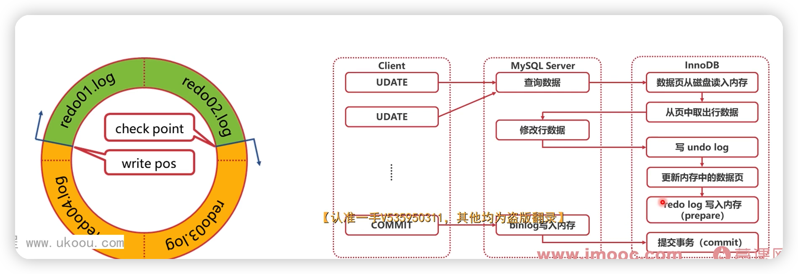

# Mysql 相关

- [高并发高性能高可用MySQL实战-慕课网 (imooc.com)](https://coding.imooc.com/class/515.html)

## 数据更新

### 日志

### MVVC

### next-key 加锁逻辑

1. 加锁以next-key为单位
2. 查找过程中扫描过的范围才加锁
3. 唯一索引等值查询，没有间隙锁，只加行锁
4. 索引等值查询最右一个扫描到的不满足条件值不加行锁
5. 索引覆盖且只加S锁时，不锁主键索引

### 刷脏页

- 将内存中的数据保存到磁盘
- 同时，删除与此页相关的redo log，推进check point

>  避免刷脏

- 配置innodb_io_capacity
- 配置innodb_max_dirty_pages_pct
- 配置innodb_flush_neighbors(SSD建议设置为0)

### 死锁问题

1. 行级锁无法释放，导致其他事务等待 -> 配置innodb_lock_wait_timeout
2. 死锁问题 -> 默认开启innodb_deadlock_detect，回滚代价较小的事务
3. MDL锁hold住大量事务，造成MySQL奔溃
   1. alter table之前，查看是否有长事务还未提交
   2. 查看长事务：information_schema库innodb_trx表

### CAS乐观锁

- https://cloud.tencent.com/developer/article/1802040
